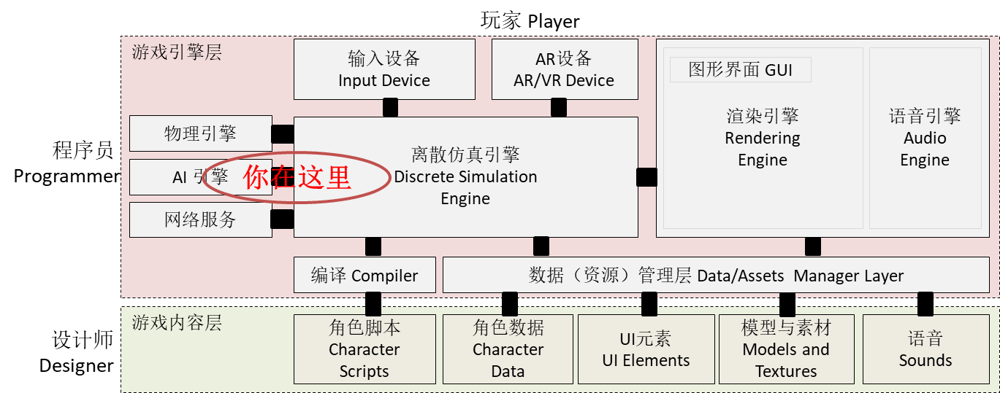
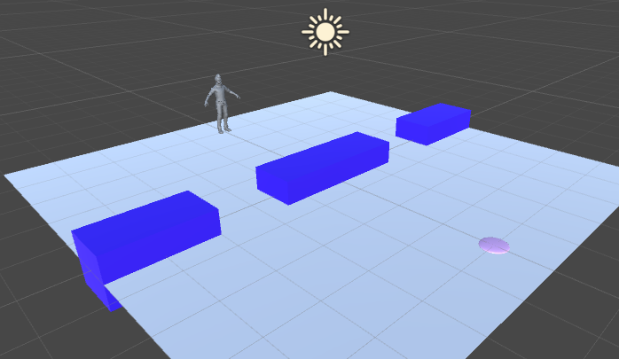
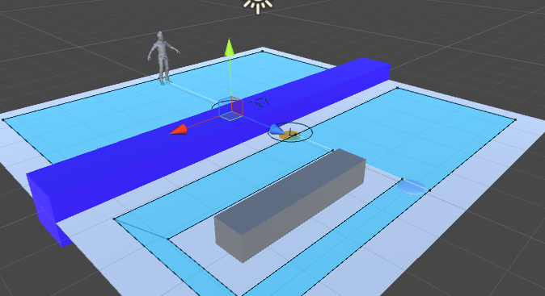

# 第十章、游戏智能
{:.no_toc}

> **_AI_**  
>   
> --- 

* 目录
{:toc}

## 课程内容与资源




## 1、游戏智能与AI

### 1.1 人工智能概述

### 1.2 游戏智能与人工智能的区别

### 1.3 游戏智能的应用场景

## 2、模型、方法与常用算法

### 2.1 感知-思考-行为 模型

### 2.2 寻路算法 A\*

### 2.3 势能场与导航（steering）

### 2.4 觅食模型与群体智能

### 2.5 10 种使智能变得萌笨的方法！！！

## 3、Unity 3D 导航与寻路

### 3.1 基本概念

Unity 导航系统允许创建给游戏角色导航的游戏世界。如下图所示，游戏角色可以在蓝色联通的网格上，找到去任意一点最短的路径，且具有一定拍坡、跳沟壑的能力。


* **NavMesh** (Navigation Mesh) 是一种数据结构，它描述了游戏对象可行走的表面。通过三角网格，计算其中任意两点之间的最短路径，用于游戏对象的导航。它是根据场景几何结构自动创建或烘焙构建。
* **NavMesh Agent**组件创建具有寻路能力的角色。Agent 使用NavMesh 推理，避免彼此以及移动障碍物。
* **Off-Mesh Link**组件允许将不连接的块之间建立“传送门”。例如，跳过沟渠或围栏，或在穿过它之前打开门，都可以被描述为 Off-Mesh Link。
* **NavMesh 障碍** 组件允许您描述 agent 在移动时应避免的移动障碍。由物理系统控制的桶或箱子就是很典型的障碍。在障碍物移动的过程中，Agent 尽力避开它，但一旦障碍物变得静止，它将在导航网格上开一个洞，以便 Agent 可以改变他们的路径以绕过它，或者静止的障碍物阻塞路径，使得 Agent 找到其他路线。

更详细的描述，参见官方 [导航系统的内部工作原理](https://docs.unity3d.com/Manual/nav-InnerWorkings.html)

### 3.2 导航设置基础

本节的任务是熟悉上述概念及其使用。

 操作 10-01 ，Agent 和 Navmesh 练习：

* 创建一个新项目
* 创建一个面。层次（Hierarchy）视图， Context 菜单 -\> 3D Object -\> Plan
* 创建蓝色材料。 Project 视图， Context 菜单  -\> Create -\> Material
* 创建一个 Cube，添加蓝色材料，制成 wall 预制
* 创建一个 Sphere，添加粉色材料，制成 target 预制
* 导入角色标准资源， Project 视图， Context 菜单  -\> Import Packages -\> Characters
* 添加 AI 角色， Standard Assets :: Charaters :: ThirdPersonCharater :: Prefabs :: AIThirdPersonController
    -  AICharacterControl 脚本写的很好，用 namespace 标识独立模块是最佳实践！ 组件功能简单，它使用 NavMeshAgent 组件，保持游戏对象实时追踪目标
    -  组件 UnityEngine.AI.NavMeshAgent ，它自己有一些设置参数。  
* 布局如图地图



图中：

* camera 的 position = (0,5.-10); rotation = (30,0,0) 
* AIThirdPersonController 的 position = (0,0,-4) 
* target 的 position = (0,0,-4)，scale = (0.5,0.1,0.5)
* wall 0 的 position = (0,0,0)， scale = (3,1,1) 
* wall 1 的 position = (4,0,0)， scale = (2,1,1) 
* wall 2 的 position = (-4,0,0)， scale = (2,1,1) 

完成布局后

* 将 target 拖入 AIThirdPersonController 对象的  AICharacterControl 组件的 Target 插槽

这时运行并不会自动寻路，系统会提示 `"GetRemainingDistance" can only be called on an active agent that has been placed on a NavMesh.`
 
现在需要的是制作 Navmesh 让 NavMeshAgent 工作

* 菜单 Windows -\> Navgation，出现如下编辑面板


* 选择 Plane，target， 选择 Navgation 的 Object 面板
    - 设置 Navigation static 选中
    - 设置 Navigation area 为 Walkable
* 选择所有 wall。
    - 设置 Navigation static 选中
    - 设置 Navigation area 为 Not walkable
* 选择 Navgation 的 Bake 面板, 图含义非常清晰，官方文档有[图解](https://docs.unity3d.com/Manual/nav-BuildingNavMesh.html)
* 点解下方 Bake 按钮，出现


图中，水蓝色凸多边形构成的网格就是寻路算法的数据结构，agent 将用它来导航。

 要预先生成的 Navmesh 、光照纹理贴图，都是高资源消耗的哦！

最后对 target 挂一段熟悉的代码：

```cs
using System.Collections;
using System.Collections.Generic;
using UnityEngine;

public class PlaceTarget : MonoBehaviour {
	
	// Update is called once per frame
	void Update () {
		if (Input.GetMouseButtonDown (0)) {    
			Ray ray = Camera.main.ScreenPointToRay (Input.mousePosition);  
			RaycastHit hit;  
			if (Physics.Raycast (ray, out hit)) {  
				Debug.Log (hit.collider.name);  
				if (hit.collider.name == "Plane") {
					this.transform.position = hit.point;
				}
			}
		}
	}
}
```

运行！寻路功能完成

 操作 10-02，Obstacle 和 Off Mesh Link 练习：

* 将当前场景另存了 nav2
* 创建一个 Cylinder
    - 设置 scale = (0.5, 0.01, 0.5)
    - 添加黄色材料，制成 mask 预制
* 在层次视图创建两个 mask 游戏对象
    - position 分别是 (0,0,-1),(0,0,1)
    - 在 Naviagtion 编辑视图选择 Object，设置为 Walkable
* 添加一个 emtpy 对象，命名 mesklink
    - 在 Inspector 窗口添加组件， Add Component -\> Navigation -\> Off Mesh Link
    - 将两个 mask 拖入组件 start, end 插槽
    - 设置 Cost -1
* 在图上放置一个灰色 cube 命名 Obstacle
    - 在 Inspector 窗口添加组件， Add Component -\> Navigation -\> Nav Mesh Obstacle
    - Nav Mesh Obstacle **选中 Carve**，它会自动切割导航网格
* 如图布局，并 Bake 生成如图 Navmesh



运行！在运行过程中，

* 修改 Obstacle 的位置，大小
* 禁灰 mesklink 和 激活 mesklink

 做一个门打开、关闭的效果，如何实现？

### 3.3 更复杂的导航应用

掌握了以上概念，做一般项目一定没问题。以下博客阅读起来也会更容易。

 参见师兄的实践 [Navmesh使用](https://blog.csdn.net/pmlpml)


### 3.4 NavMesh 构建与工具

使用 Bake 构建的导航并不一定能满足所有游戏需求。因此有必要根据物体表面手动编辑或程序控制 navmesh。

具体参见官方手册

## 4、作业

**无**，仅收集以下博客

1、 简单 AR 小游戏制作

2、 从商店下载游戏：“Kawaii” Tank，构建 AI 对战游戏

3、P&D 过河游戏智能帮助实现，程序要求：

* 实现状态图的自动生成
* 讲解图数据在程序中的表示
* 利用算法实现下一步的计算
* 参考：[P&D 过河游戏智能帮助实现](https://blog.csdn.net/kiloveyousmile/article/details/71727667)


