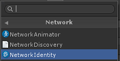
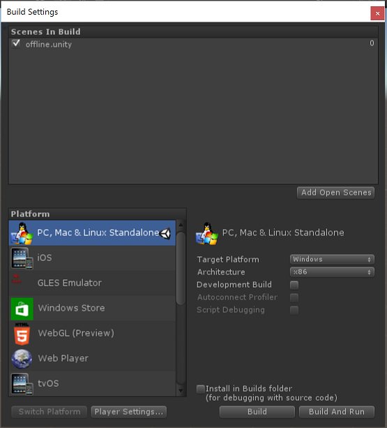
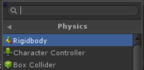
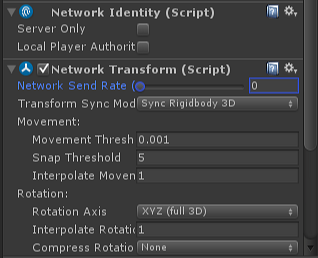

# 第 13 章 多人游戏与网络
{:.no_toc}

> **_万人操弓，共射一招，招无不中_**  
>   
> --- 【先秦】 《吕氏春秋》

* 目录
{:toc}

## 1、网络游戏

## 2、从零开始设置多人游戏（练习）

本部分介绍了设置简单多人游戏项目的步骤。这个循序渐进的过程是普适的，可以帮助理解 UNet 的一些基本概念。

_注：以下内容主要来自 unity 5.5 手册 Setting up a Multiplayer Project from Scratch, 由谷歌预翻译，作者重新整理_

**请创建一个新的空Unity项目**，开启网络游戏之旅。

## 2.1 联网运动对象

本级主要介绍[玩家对象](https://docs.unity3d.com/Manual/UNetPlayers.html)，并研究如何实现本地创建的玩家对象在网络上被创建、运动控制与同步。

*注：玩家对象 在 Unity 5 版本称为 _Player Objects_。从 Unity 2017 称为 _Player GameObject_

设置内容包括：

* 网络控制器（**Network Manager**）和 用户控制界面（**Network Manager HUD**，供玩家找到并加入游戏）
* 玩家预制（**Player Prefabs** 玩家控制的本地对象）
* 联网感知（**multiplayer-aware**）的 Scripts 和 GameObjects

具体步骤如下：

**1）NetworkManager 设置**

第一步是在项目中创建 NetworkManager 对象：

* 从菜单 Game Object -\> Create Empty 添加一个新的空游戏对象。
* 在层次结构视图中选择它。
* 将对象重命名为“NetworkManager”，使用右键上下文菜单中或单击对象的名称并键入。
* 在对象的检查器窗口中，单击添加组件按钮
* 找到组件 Network -\> NetworkManager 并将其添加到对象。该组件管理游戏的网络状态。


* 找到组件 Network -\> NetworkManagerHUD 并将其添加到对象。该组件在您的游戏中提供了一个简单的用户界面来控制网络状态。


有关更多详细信息，请参阅使用 NetworkManager。

**2）设置玩家对象预制**

下一步是设置代表游戏中玩家对象的 Unity Prefab。默认情况下，NetworkManager 通过克隆玩家预制来为 Client 实例化玩家对象。在这个例子中，玩家对象将是一个简单的立方体。

* 从菜单 Game Object -\> 3D Object -\> Cube 创建一个新的立方体


* 在层次视图中找到该立方体并选择它
* 将对象重命名为 “PlayerCube”
* 在对象的检查器窗口中，单击添加组件按钮
* 将组件 Network -\> NetworkIdentity 添加到对象。该组件用于标识服务器和客户端之间的对象。



* 将 NetworkIdentity 上的 “Local Player Authority” 复选框设置为 true。这将允许客户端控制玩家对象的移动


* 将立方体对象拖放到资源窗口中制作预制件。创建一个名为 “PlayerCube” 的预制件
* 从场景中删除 PlayerCube 对象 - 现在我们不需要它，我们有一个预制

详细信息 参考 Player Objects

**3）注册玩家预制**

一旦玩家预制被创建，它就必须在网络系统上注册。

* 在层次视图中找到 NetworkManager 对象并选择它
* 在 NetworkManager 组件面板打开 “Spawn Info” 折叠
* 找到 “Player Prefab” 插槽（可以拖入对象的属性）
* 将 PlayerCube 预制件拖入 “Player Prefab” 插槽


现在，请第一次保存该项目。从菜单 File -\> Save 保存项目。你也应该保存场景, 让我们称这个场景为 “offline” 场景。

**4）玩家对象运动（单人版）**

第一版游戏功能是移动玩家对象。在没有联网的情况下完成，因此它工作在单人模式下。

* 在资源视图中查找 PlayerCube 预制件。
* 点击Add Component 按钮并选择 “New Script”
* 为新的脚本名称输入名称 “PlayerMove”。一个新的脚本将被创建。
* 通过双击它在编辑器（如 Visual Studio）中打开这个新脚本
* 将这个简单的移动代码添加到脚本中：

```cs
using UnityEngine;

public class PlayerMove : MonoBehaviour
{
    void Update()
    {
        var x = Input.GetAxis("Horizontal")*0.1f;
        var z = Input.GetAxis("Vertical")*0.1f;

        transform.Translate(x, 0, z);
    }
}
```

这将钩住由箭头箭头键或控制板控制立方体。立方体只能在客户端上移动 - 它不是联网的。

再次保存该项目。

**5）测试主机（hosted）游戏**

点击播放按钮，在编辑器中进入运行模式。您应该看到 NetworkManagerHUD 的默认用户界面：
 


按 “HOST” 以游戏主机模式开始游戏。玩家对象被创建，并且 HUD 显示服务器处于活动状态。这个游戏是作为“主机”运行的 - 这时服务器和客户端在同一个进程中。

请参阅：Network Concepts。

按下箭头键可以让玩家立方体对象四处移动。

通过在编辑器中按停止按钮退出运行模式。

**6）测试玩家对客户的移动**

* 使用菜单 File -\> Build Settings 打开 Build Settings 对话框。
* 按下 “Add Open Scenes” 按钮，将当前场景添加到版本



* 按 “Build and Run” 按钮创建构建。这会提示输入可执行文件的名称，输入一个名称，如“networkTest”
* 编译后的独立程序将启动，并显示分辨率选择对话框。
* 选择 “windowed” 复选框和较低的分辨率，如640x480
* 程序将启动并显示 NetworkManager HUD。
* 从菜单中选择 “HOSTED” 作为主机启动。应该创建一个玩家多维数据集
* 按箭头键稍微移动玩家立方体
* 切换回编辑器并关闭 Build Settings 对话框。
* 使用运行按钮进入运行模式
* 从 NetworkManagerHUD 用户界面中，选择 “LAN Client” 作为客户端连接到主机
* 应该出现两个立方体，一个在主机上的本地运行，另一个在该客户端的远程运行
* 按箭头键移动立方体
* 这两个立方体都在移动 这是因为移动脚本没有网络同步。

**7）联网玩家对象的运动**

* 关闭独立运行程序
* 在编辑器中退出运行模式
* 打开 PlayerMove 脚本。
* 更新脚本以仅移动本地播放器
* 添加 **“Using UnityEngine.Networking”**
* 将 “MonoBehaviour” 更改为 **“NetworkBehaviour”**
* 在Update函数中添加一个 “isLocalPlayer” 检测，以便只有本地程序处理输入

具体代码：

```cs
using UnityEngine;
using UnityEngine.Networking;

public class PlayerMove : NetworkBehaviour
{
    void Update()
    {
        if (!isLocalPlayer)
            return;

        var x = Input.GetAxis("Horizontal")*0.1f;
        var z = Input.GetAxis("Vertical")*0.1f;

        transform.Translate(x, 0, z);
    }
}
```

* 在资源视图中找到 PlayerCube 预制并选择
* 单击 “Add Component” 按钮并添加 Networking -\> NetworkTransform 组件。该组件使对象在网络中同步它的位置。


再次保存该项目

**8）测试多人游戏**

* 重新编译并运行独立程序并以 HOST 模式启动
* 在编辑器中进入运行模式并作为客户端连接
* 玩家对象现在应该彼此独立移动，并且由其客户端上的本地玩家控制。

**9）识别本地玩家对象**

游戏中的立方体当前都是白色，因此用户无法确定哪个立方体是立方体。为了识别玩家，我们将使本地玩家的立方体变红。

* 打开 PlayerMove 脚本
* 添加 OnStartLocalPlayer 函数的实现来更改运行期间玩家对象的颜色。

```cs
    public override void OnStartLocalPlayer()
    {
        GetComponent<MeshRenderer>().material.color = Color.red;
    }
```

该功能仅在其客户端的本地程序调用。这将使用户看到本地创建的立方体为红色。OnStartLocalPlayer 函数是本地玩你家对象初始化的好地方，仅用于本地程序执行，例如配置摄像头和输入。

NetworkBehaviour 基类还有其他有用的虚函数，详见 Spawning。

* 构建并运行游戏
* 现在由本地玩家控制的立方体应该是红色，而其他的仍然是白色。

## 2.2 联网相互射击

多人游戏中的一个共同特点是让玩家发射子弹。当子弹与玩家对象发生碰撞时，就会消灭对方。

设置内容包括：

* 一个对象预制（Bullet），添加 Rigidbody 等部件
* 添加 NetworkIdentity，NetworkTransform 并注册到 NetworkManager （用于服务器 Spawn）
* 一个运行于服务器的 CmdXXX 方法。 AOP（面向截面编程） 编织(weave) 为远程过程调用方法（）RPC

具体步骤如下：

**1）射击子弹（未联网）**

先添加非联网子弹，再改为联网的子弹。

* 创建一个球体游戏对象


* 将球体对象重命名为 “Bullet”
* 将子弹的比例从 1.0 改为 0.2
* 将子弹拖到资源文件夹制作预制
* 从场景中删除子弹对象
* 给子弹添加一个Rigidbody组件



* 将刚体上的 “Use Gravity” 复选框设置为 false
* 更新PlayerMove脚本以发射子弹：
    - 添加公共变量（slot/插槽）放置子弹预制
    - 在 Update 函数中添加输入处理
    - 添加一个函数 Fire 来发射子弹

```cs
using UnityEngine;
using UnityEngine.Networking;

public class PlayerMove : NetworkBehaviour
{
    public GameObject bulletPrefab;

    public override void OnStartLocalPlayer()
    {
        GetComponent<MeshRenderer>().material.color = Color.red;
    }

    void Update()
    {
        if (!isLocalPlayer)
            return;

        var x = Input.GetAxis("Horizontal")*0.1f;
        var z = Input.GetAxis("Vertical")*0.1f;

        transform.Translate(x, 0, z);

        if (Input.GetKeyDown(KeyCode.Space))
        {
            Fire();
        }
    }

    void Fire()
    {
        // create the bullet object from the bullet prefab
        var bullet = (GameObject)Instantiate(
            bulletPrefab,
            transform.position - transform.forward,
            Quaternion.identity);

        // make the bullet move away in front of the player
        bullet.GetComponent<Rigidbody>().velocity = -transform.forward*4;
        
        // make bullet disappear after 2 seconds
        Destroy(bullet, 2.0f);        
    }
}
```

* 保存脚本并返回到编辑器
* 选择 PlayerCube 预制并找到 PlayerMove 组件
* 在组件上找到 bulletPrefab 插槽
* 将子弹预制件拖入 bulletPrefab 插槽


* 构建项目，然后启动作为主机的独立程序
* 在编辑器中进入运行模式并作为客户端连接
* 按空格键应该会导致一个子弹被创建并从玩家对象中发射
* 子弹不会在其他客户端上被触发，只有空格键被按下。
* 主机与编辑器退出运行状态

**2）联网射击子弹**

* 找到子弹预制件并选择它
* 将 NetworkIdentity 添加到项目符号预制
* 将 NetworkTransform 组件添加到项目符号预制
* 在子弹预制的 NetworkTransform 组件上将发送速率设置为零。子弹在射击后不会改变方向或速度，因此不需要发送移动更新。



注：请注意 Bullet 和 PlayCube 预知 NetworkTransform 组件 **Transform Syns Mod** 的不同 

* 选择 NetworkManager 并打开 “Spawn Info” 折叠
* 用 Add 按钮添加一个新的 spawn 预制件
* 将 Bullet 预制件拖入新的 spawn 预制插槽


* 打开 PlayerMove 脚本
* 更新 PlayerMove 脚本来联网发射子弹：
    - 通过添加 [Command] 自定义属性和“Cmd”前缀，将Fire功能更改为联网命令
    - 在子弹对象上使用Network.Spawn（）

```cs    
using UnityEngine;
using UnityEngine.Networking;

public class PlayerMove : NetworkBehaviour
{
    public GameObject bulletPrefab;
    
    public override void OnStartLocalPlayer()
    {
        GetComponent<MeshRenderer>().material.color = Color.red;
    }

    [Command]
    void CmdFire()
    {
       // This [Command] code is run on the server!

       // create the bullet object locally
       var bullet = (GameObject)Instantiate(
            bulletPrefab,
            transform.position - transform.forward,
            Quaternion.identity);

       bullet.GetComponent<Rigidbody>().velocity = -transform.forward*4;
       
       // spawn the bullet on the clients
       NetworkServer.Spawn(bullet);
       
       // when the bullet is destroyed on the server it will automaticaly be destroyed on clients
       Destroy(bullet, 2.0f);
    }

    void Update()
    {
        if (!isLocalPlayer)
            return;

        var x = Input.GetAxis("Horizontal")*0.1f;
        var z = Input.GetAxis("Vertical")*0.1f;

        transform.Translate(x, 0, z);

        if (Input.GetKeyDown(KeyCode.Space))
        {
            // Command function is called from the client, but invoked on the server
            CmdFire();
        }
    }
}
```

此代码使用 [Command] 在服务器上在运行该代码，并向所有客户端 Spawn 创建的 Bullet 对象。有关更多信息，请参阅 [Networked Actions/Remote Actions](https://docs.unity3d.com/2018.1/Documentation/Manual/UNetActions.html)。

* 构建，然后启动作为主机的独立应用
* 在编辑器中进入运行模式并作为客户端连接
* 按下空格键应该让所有客户端上的正确观察到玩家发射的子弹

**3）子弹碰撞**

这里增加了一个碰撞处理程序，以便子弹在击中玩家立方体对象时消失。

* 找到子弹预制件并选择它
* 选择 Add Component 按钮并添加一个新脚本
* 调用新脚本“Bullet”
* 打开新脚本并添加碰撞处理程序，该程序在击中玩家对象时销毁子弹

```cs
using UnityEngine;

public class Bullet : MonoBehaviour
{
    void OnCollisionEnter(Collision collision)
    {
        var hit = collision.gameObject;
        var hitPlayer = hit.GetComponent<PlayerMove>();

        if (hitPlayer != null)
        {
			print ("hit player");
			Destroy(gameObject);
			Destroy(hit);
        }
    }
}
```

现在当子弹击中玩家对象时，它将被销毁。当服务器上的子弹销毁时，由于它是由网络管理的衍生对象，因此它也将在客户端上销毁。


## 2.3 玩家状态同步

与子弹射击有关的一个共同特征是玩家对象具有满血开始的“生命值”属性，然后当玩家受到子弹击中伤害时减少, 这个值需要在网络中同步。

**1）玩家状态（非联网生命值）**

先添加生命值到玩家对象。

* 选择 PlayerCube 预制
* 选择 Add Component 按钮并添加一个新脚本
* 脚本名称 “Combat”
* 打开 Combat 脚本，添加健康变量和 TakeDamage 函数

```cs
using UnityEngine;

public class Combat : MonoBehaviour 
{
    public const int maxHealth = 100;
    public int health = maxHealth;

    public void TakeDamage(int amount)
    {
        health -= amount;
        Debug.Log("health value = " + health.toSting());
        if (health <= 0)
        {
            health = 0;
            Debug.Log("Dead!");
        }
    }
}
```

子弹脚本需要更新，以在命中时调用 TakeDamage 函数。

*打开 bullet 脚本
    - 在碰撞处理函数中添加一个来自 Combat 脚本的 TakeDamage 函数调用

```cs
using UnityEngine;

public class Bullet : MonoBehaviour
{
    void OnCollisionEnter(Collision collision)
    {
        var hit = collision.gameObject;
        var hitPlayer = hit.GetComponent<PlayerMove>();
        if (hitPlayer != null)
        {
            var combat = hit.GetComponent<Combat>();
            combat.TakeDamage(30);

            Destroy(gameObject);
        }
    }
}
```

当被子弹击中时，这会使玩家对象的健康状态下降。但是你不能在游戏中看到这种情况。我们需要添加一个简单的健康栏。

* 选择 PlayerCube 预制
* 选择 Add Component  按钮并添加一个名为 HealthBar 的新脚本
* 打开 HealthBar 脚本

这是很多使用旧 IMGUI 系统的代码。这对于网络来说并不相关，所以我们现在就使用它而没有解释。

```cs
using UnityEngine;
using System.Collections;

public class HealthBar : MonoBehaviour 
{
    GUIStyle healthStyle;
    GUIStyle backStyle;
    Combat combat;

    void Awake()
    {
        combat = GetComponent<Combat>();
    }

    void OnGUI()
    {
        InitStyles();

        // Draw a Health Bar

        Vector3 pos = Camera.main.WorldToScreenPoint(transform.position);
        
        // draw health bar background
        GUI.color = Color.grey;
        GUI.backgroundColor = Color.grey;
        GUI.Box(new Rect(pos.x-26, Screen.height - pos.y + 20, Combat.maxHealth/2, 7), ".", backStyle);
        
        // draw health bar amount
        GUI.color = Color.green;
        GUI.backgroundColor = Color.green;
        GUI.Box(new Rect(pos.x-25, Screen.height - pos.y + 21, combat.health/2, 5), ".", healthStyle);
    }

    void InitStyles()
    {
        if( healthStyle == null )
        {
            healthStyle = new GUIStyle( GUI.skin.box );
            healthStyle.normal.background = MakeTex( 2, 2, new Color( 0f, 1f, 0f, 1.0f ) );
        }

        if( backStyle == null )
        {
            backStyle = new GUIStyle( GUI.skin.box );
            backStyle.normal.background = MakeTex( 2, 2, new Color( 0f, 0f, 0f, 1.0f ) );
        }
    }
    
    Texture2D MakeTex( int width, int height, Color col )
    {
        Color[] pix = new Color[width * height];
        for( int i = 0; i < pix.Length; ++i )
        {
            pix[ i ] = col;
        }
        Texture2D result = new Texture2D( width, height );
        result.SetPixels( pix );
        result.Apply();
        return result;
    }
}
```

* 保存该项目
* 构建并运行游戏并查看玩家对象的健康栏
* 如果玩家现在射击另一个玩家，则该特定客户端的健康状况会下降，但其他客户端则不会。

**2）玩家状态（网络健康）**

生命值变化在游戏中广泛应用。每个客户机看到不同的玩家的生命值不同。运行状况应只应用于服务器，并将更改复制到客户端。我们称服务器为生命之“服务授权”。

* 打开战斗脚本
    - 将脚本更改为 NetworkBehaviour
    - 使生命之属性装饰为 [SyncVar]
    - 将 isServer 检查添加到 TakeDamage 中，所以它只会应用在服务器上

有关SyncVars的更多信息，请参阅 [State Synchronization]()。

```cs
using UnityEngine;
using UnityEngine.Networking;

public class Combat :  NetworkBehaviour 
{
    public const int maxHealth = 100;

    [SyncVar]
    public int health = maxHealth;

    public void TakeDamage(int amount)
    {
        if (!isServer)
            return;

        health -= amount;
        if (health <= 0)
        {
            health = 0;
            Debug.Log("Dead!");
        }
    }
}
```

**3）死亡和重生**

目前，除了日志消息之外，当玩家的健康状况达到零时，目前没有任何事情发生。为了让游戏更具游戏性，当健康状况达到零时，玩家应该以完全健康的方式传送回起始位置。

打开战斗脚本
添加一个[ClientRpc]功能重新生成玩家对象。有关更多信息，请参阅联网操作。
当运行状况达到零时，调用服务器上的重新启动功能
using UnityEngine;
using UnityEngine.Networking;

public class Combat :  NetworkBehaviour 
{
    public const int maxHealth = 100;

    [SyncVar]
    public int health = maxHealth;

    public void TakeDamage(int amount)
    {
        if (!isServer)
            return;

        health -= amount;
        if (health <= 0)
        {
            health = maxHealth;

            // called on the server, will be invoked on the clients
            RpcRespawn();
        }
    }

    [ClientRpc]
    void RpcRespawn()
    {
        if (isLocalPlayer)
        {
            // move back to zero location
            transform.position = Vector3.zero;
        }
    }
}
在这个游戏中，客户端控制玩家对象的位置 - 玩家对象在客户端具有“本地权限”。如果服务器只是将玩家的位置设置为开始位置，则客户端将覆盖该位置，因为客户端具有权限。为了避免这种情况，服务器通知拥有的客户端将播放器对象移动到开始位置。

构建并运行游戏
将玩家对象从开始位置移开
在一名玩家身上射击子弹，直到他们的健康状况达到零
玩家对象应该传送到开始位置。
非玩家对象
虽然玩家对象是在客户端连接到主机时产生的，但大多数游戏都存在游戏世界中存在的非玩家对象，例如敌人。在本节中添加了一个产卵者，它可以创建可以被射杀的非玩家对象。

从GameObject菜单中创建一个新的空游戏对象
将该对象重命名为“EnemySpawner”
选择EnemySpawner对象
选择添加组件按钮并将NetworkIdentity添加到该对象
在NetworkIdentity中单击“仅服务器”复选框。这使得产卵者不会被发送给客户。
选择Add Component按钮并创建一个名为“EnemySpawner”的新脚本
编辑新脚本
使其成为NetworkBehaviour
实现虚拟功能OnStartServer来创建敌人
using UnityEngine;
using UnityEngine.Networking;

public class EnemySpawner : NetworkBehaviour {

    public GameObject enemyPrefab;
    public int numEnemies;

    public override void OnStartServer()
    {
        for (int i=0; i < numEnemies; i++)
        {
            var pos = new Vector3(
                Random.Range(-8.0f, 8.0f),
                0.2f,
                Random.Range(-8.0f, 8.0f)
                );

            var rotation = Quaternion.Euler( Random.Range(0,180), Random.Range(0,180), Random.Range(0,180));

            var enemy = (GameObject)Instantiate(enemyPrefab, pos, rotation);
            NetworkServer.Spawn(enemy);
        }
    }
}
现在创建一个敌人预制件：

从GameObject菜单中创建一个新的Capsule。
将对象重命名为“Enemy”
选择添加组件按钮将一个NetworkIdentity组件添加到敌人
选择添加组件按钮将NetworkTransform组件添加到敌人
将Enemy对象拖到资产视图中以创建预制件
应该有一个现在称为“敌人”的预制资产
从场景中删除Enemy对象
选择敌人预制
选择添加组件按钮并将战斗脚本添加到敌人
选择Add Component按钮并将HealthBar脚本添加到敌人
选择NetworkManager并在Spawn Info中添加一个新的可重复使用的预制件
将新的spawn预制设置为敌方预制
子弹脚本设置为仅适用于玩家。现在更新项目符号脚本以处理任何具有Combat脚本的对象：

打开项目符号脚本
更改碰撞检查以使用Combat而不是PlayerMove：
using UnityEngine;

public class Bullet : MonoBehaviour
{
    void OnCollisionEnter(Collision collision)
    {
        var hit = collision.gameObject;
        var hitCombat = hit.GetComponent<Combat>();
        if (hitCombat != null)
        {
            hitCombat.TakeDamage(10);
            Destroy(gameObject);
        }
    }
}
连接敌人物品的敌人：

选择EnemySpawner对象
找到EnemySpawner组件上的“Enemy”插槽
将敌人预制物拖入插槽
将numEnemies值设置为4
测试敌人：

构建并运行游戏
当作为主持人开始时，应该在随机位置创建四个敌人
玩家应该能够射击敌人，他们的健康状况应该下降
当客户加入时，他们应该看到处于相同位置的敌人，以及与服务器上相同的健康值
摧毁敌人
虽然敌人可以用子弹射击并且他们的健康状况下降，但是像玩家一样重生。当他们的健康达到零而不是重生时，敌人应该被毁灭。

打开战斗脚本
添加一个“destroyOnDeath”变量
当健康状况达到零时检查destroyOnDeath
using UnityEngine;
using UnityEngine.Networking;

public class Combat :  NetworkBehaviour 
{
    public const int maxHealth = 100;
    public bool destroyOnDeath;

    [SyncVar]
    public int health = maxHealth;

    public void TakeDamage(int amount)
    {
        if (!isServer)
            return;

        health -= amount;
        if (health <= 0)
        {
            if (destroyOnDeath)
            {
                Destroy(gameObject);
            }
            else
            {
                health = maxHealth;

                // called on the server, will be invoked on the clients
                RpcRespawn();
            }
        }
    }

    [ClientRpc]
    void RpcRespawn()
    {
        if (isLocalPlayer)
        {
            // move back to zero location
            transform.position = Vector3.zero;
        }
    }
}

选择敌人预制
将敌人的destroyOnDeath复选框设置为true
现在当生命值为零时敌人将被摧毁，但玩家将重生。

派生玩家的位置
玩家目前全部出现在创建时的零点。这意味着它们可能在彼此之上。玩家应该在不同的地点产卵。NetworkStartPosition组件可用于执行此操作。

创建一个新的空GameObject

将该对象重命名为“Pos1”

选择添加组件按钮并添加NetworkStartPosition组件

将Pos1对象移动到位置（-3,0,0）

创建第二个空的GameObject

将对象重命名为“Pos2”

选择添加组件按钮并添加NetworkStartPosition组件

将Pos2对象移到位置（3,0,0）

找到NetworkManager并选择它。

打开“产卵信息”折页

将“玩家衍生方法”更改为“循环法”

构建并运行游戏

现在应该在Pos1和Pos2对象的位置创建播放器对象，而不是零。


http://blog.theknightsofunity.com/turn-based-multiplayer-game-gamesparks-unity-1/