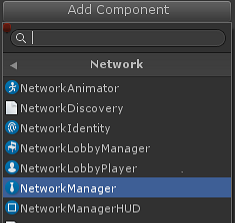
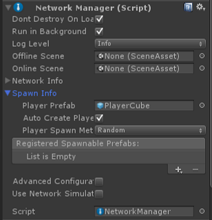
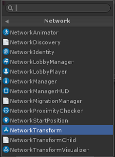
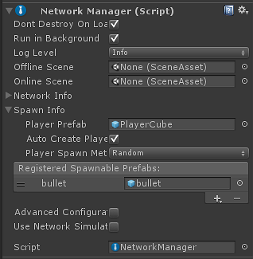

# 第 13 章 多人游戏与网络
{:.no_toc}

> **_万人操弓，共射一招，招无不中_**  
>   
> --- 【先秦】 《吕氏春秋》

* 目录
{:toc}

## 1、网络游戏概述

本质上，多人联网游戏是细致和复杂的技术。一个游戏的多个实例运行在不同的机器上，且这些机器可能位于世界不同的和遥远的地方，这些游戏实例内部的游戏对象之间进行同步和通信时，会遇到许多特殊的问题和困难。

本部分主要关注 Unity 内置的多人联网和相关的高级API（HLAPI），希望能够使得创建多人游戏项目更容易使用。

### 1.1 多人游戏与网络游戏

[多人视频游戏](https://en.wikipedia.org/wiki/Multiplayer_video_game)是一类视频游戏，多个人可以在同一时间同一个游戏环境游戏。视频游戏通常是单人游戏，让玩家接受编程预设的挑战或 AI 控制的对手（缺乏人类思维）。多人游戏允许玩家与对手合作、竞争，并开展人类社交互动。在多人游戏中，玩家可以一人挑战多个选手，或与人合作以实现共同的目标，或监督、指导其他玩家的活动。多人游戏通常分享单个游戏系统资源或使用网络技术，使得在更远的距离上一起玩游戏。

[网络游戏/在线游戏](https://en.wikipedia.org/wiki/Online_game)是一类视频游戏，游戏的部分或全部内容通过互联网或计算机网络。网络游戏是无处不在的现代游戏平台，包括个人计算机，游戏机和移动设备，涉及多个主题，包括第一人称射击游戏，策略游戏和巨量多人在线角色扮演游戏（Massive Multi Player Online Game/MMORPG）等。

在线游戏的设计可以从简单的基于文本的环境到复杂的图形和虚拟世界的结合。游戏中的在线组件的存在范围可以简单到在线排行榜等次要特征，也可以到作为核心游戏玩法的一部分，如直接与其他玩家一起分享一个场景。许多网络游戏创建自己的在线社区（包括其他游戏），尤其是社交游戏，则整合了玩家现有的现实生活。

**技术驱动者游戏架构发展，推动了游戏玩法和应用的创新**

* [视频游戏](https://en.wikipedia.org/wiki/Video_game)是一种电子游戏，以产生视觉反馈视频设备如电视屏幕或计算机监视器，形成多媒体交互用户界面。
    - 1947 年 Thomas T. Goldsmith Jr. 发明了 Estle Ray Mann 电子管
    - 1952 年 William Higinbotham 开发了 [Tennis for Two](https://en.wikipedia.org/wiki/Tennis_for_Two) 电子互动游戏
    - 1981 年 Nintendo（任天堂）开发了著名的 Mario 系列电子游戏，视频游戏普及
* 多人视频游戏
    - 1950 年 IBM 推出了现代多用户主机操作系统 OS/360
    - 1973 年 在多用户实时操作系统 PLATO 上，开发了第一代多人游戏 Empire ，次年推出了 Spasim
* 网络游戏/在线游戏
    - 1969 年 建立了有四个节点的第一代计算机网络，[ARPANET](https://en.wikipedia.org/wiki/ARPANET)，计算机网络进入商用
    - 1973 年 以太网 Xerox PARC 出现，消除了游戏之间巨大的延时
    - 1993 年 第一代网络游戏  [DOOM](https://en.wikipedia.org/wiki/Doom_\(1993_video_game\)) 出现，支持四个在线玩家
    - 2004 年 暴雪娱乐发布的一款大型多人在线角色扮演游戏（MMORPG）魔兽世界（World of Warcraft），也称在线策略游戏（MMORTS）
* [社交游戏](https://en.wikipedia.org/wiki/Social-network_game)（Social-Network Games） 是一种 Massively multiplayer online game （MMO）游戏，强度通过社区网络构建虚拟世界。
    - 社交游戏的鼻祖是 [MUDs](https://en.wikipedia.org/wiki/MUD)

Todo: 网络游戏分类与玩法等 参考 [百度百科](http://www.baike.com/wiki/%E7%BD%91%E7%BB%9C%E6%B8%B8%E6%88%8F)

### 1.2 多人网络游戏基本结构

**1、P2P 局域网对战架构**

P2P局域网对象游戏是最流行的网络游戏架构，每个玩家一个游戏实例运行于自己的主机之上，主机之间采用Peer-to-Peer的直接通信方式。在网络通信服务的形式上，一般采用浮动服务器，即其中一个玩家的机器既是客户端，又扮演服务器的角色，通常由创建游戏的玩家担任服务器（HOST）。多数即时对战MMORTS网络游戏采用这种结构。

**2、游戏大厅代理的结构**

通过会话大厅（lobby），为不同玩家牵线搭桥，既直接管理客户端，也管理游戏，是回合制网络游戏的常见类型。如各种棋牌类网络游戏。

**3、C/S 结构**

网络游戏典型的结构是C/S结构，特别适合于多人在线游戏，成千上万人进行同一场游戏。服务器上有完整的游戏世界模型，玩家在客户端去观察这个世界，并与之互动。C/S结构的优点是能够充分发挥客户端计算机的处理能力，很多工作可以在客户端处理后再提交给服务器，使得客户端响应速度快。对于网络游戏来讲，这是十分关键的。 

缺点就是网络游戏的升级比较麻烦，每次升级需要客户端下载体积庞大的更新软件，然后进行安装，对于一些带宽并不是十分充足的用户而言，升级就成了游戏的梦魇。不过，良好的客户端程序框架设计完全可以避免升级时下载庞大的更新软件。比如，客户端软件可以把场景定义文件独立出来，客户端程序在运行时动态加载 场景定义文件。这样，当网络游戏的设计者发现需要增加游戏场景时，他只需要更新一个场景定义文件就可以了，当然还需要一些必需的场景资源文件，如新增加的 图像、背景音效等。

### 1.3 Unity 网络游戏的概念与解决方案

从 Unity 5.0 开始，提供了全新的 UNet 开发网络游戏，面向两种类型的用户：

* 使用 Unity 开发简单多人游戏，应该从高阶 API 开始
    - 使用 “NetworkManager” 管理网络，控制游戏对象网络状态
    - 从客户端调用服务器函数 或 从服务器调用客户端函数
    - 使用网络组件，可视化编辑程序
    - Internet 服务支持
* 用户自定义网络基础设施或高级多人游戏，应该从 NetworkTransport API 开始
    - 使用 UDP 等
    - 自建复杂的网络结构

#### 1.3.1 网络 HLAPI 概念

**1、主机与服务器**

**HOST**：主机，运行服务器程序的机器

**Server**：服务器，游戏程序实例。它连接所有客户端，并管理所有客户端共享的游戏对象及部分需要同步的状态（属性）

**Client**：客户端，游戏程序实例。玩家游戏主机运行的程序

Unity 典型的网络游戏结构：


**2、实例化与孵化**

在一个单机中，游戏对象创建称为**实例化（Instantiate）** 

在网络游戏中，网络游戏对象，客户端必须从服务器接受这些对象及其属性，称为**孵化（Spawn）**，并由服务器的孵化系统（Spawning System）管理分布式对象生命周期和状态同步

**3、网络游戏对象**

**网络游戏对象（Networked GameObjects）** ：在服务器上注册，由孵化系统（Spawning System）管理的对象，它必须包含 NetworkIdentity 组件，并用 NetworkBehaviour 脚本编程。

**玩家游戏对象（player  GameObjects）**是特殊的网络游戏对象，指一个 client 加入网络游戏，服务器创建并孵化到客户端，由玩家控制的游戏对象。客户端代码可以控制它们的状态，并自动有服务器同步到其他玩家的客户端。例如：联网赛车游戏，每个玩家都有属于自己的赛车。


**网络权限**，指网络游戏对象在本地、服务器被控制的权利。

**4、远程动作**

服务器调用客户端对应游戏对象的方法（Client RPC），或反之（Command）。


## 2、从零开始设置多人游戏

本部分介绍了设置简单多人游戏项目的步骤。这个 step-by-step 的过程是通用的，可以帮助理解 UNet 的一些基本概念。

_以下内容主要来自 unity 5.5 手册 Setting up a Multiplayer Project from Scratch, 作者翻译并重新整理_

**请创建一个新的空Unity项目**，开启网络游戏之旅。

### 2.1 玩家对象联网运动

本级主要介绍[玩家对象](https://docs.unity3d.com/Manual/UNetPlayers.html)，并研究如何实现本地创建的玩家对象在网络上被创建、运动控制与同步。

 _玩家对象 在 Unity 5 版本称为 _Player Objects_。从 Unity 2017 称为 _Player GameObject_

 **编程练习 13-1：**

设置内容包括：

* 网络控制器（**Network Manager**）和 用户控制界面（**Network Manager HUD**，供玩家找到并加入游戏）
* 玩家预制（**Player Prefabs** 玩家控制的本地对象）
* 联网感知（**multiplayer-aware**）的 Scripts 和 GameObjects

具体步骤如下：

**1）NetworkManager 设置**

第一步是在项目中创建 NetworkManager 对象：

* 从菜单 Game Object -\> Create Empty 添加一个新的空游戏对象。
* 在层次结构视图中选择它。
* 将对象重命名为“NetworkManager”，使用右键上下文菜单中或单击对象的名称并键入。
* 在对象的检查器窗口中，单击添加组件按钮
* 找到组件 Network -\> NetworkManager 并将其添加到对象。该组件管理游戏的网络状态。



* 找到组件 Network -\> NetworkManagerHUD 并将其添加到对象。该组件在您的游戏中提供了一个简单的用户界面来控制网络状态。


有关更多详细信息，请参阅使用 NetworkManager。

**2）设置玩家对象预制**

下一步是设置代表游戏中玩家对象的 Unity Prefab。默认情况下，NetworkManager 通过克隆玩家预制来为 Client 实例化玩家对象。在这个例子中，玩家对象将是一个简单的立方体。

* 从菜单 Game Object -\> 3D Object -\> Cube 创建一个新的立方体


* 在层次视图中找到该立方体并选择它
* 将对象重命名为 “PlayerCube”
* 在对象的检查器窗口中，单击添加组件按钮
* 将组件 Network -\> NetworkIdentity 添加到对象。该组件用于标识服务器和客户端之间的对象。


* 将 NetworkIdentity 上的 “Local Player Authority” 复选框设置为 true。这将允许客户端控制玩家对象的移动


* 将立方体对象拖放到资源窗口中制作预制件。创建一个名为 “PlayerCube” 的预制件
* 从场景中删除 PlayerCube 对象 - 现在我们不需要它，我们有一个预制

详细信息 参考 Player Objects

**3）注册玩家预制**

一旦玩家预制被创建，它就必须在网络系统上注册。

* 在层次视图中找到 NetworkManager 对象并选择它
* 在 NetworkManager 组件面板打开 “Spawn Info” 折叠
* 找到 “Player Prefab” 插槽（可以拖入对象的属性）
* 将 PlayerCube 预制件拖入 “Player Prefab” 插槽



现在，请第一次保存该项目。从菜单 File -\> Save 保存项目。你也应该保存场景, 让我们称这个场景为 “offline” 场景。

**4）玩家对象运动（单人版）**

第一版游戏功能是移动玩家对象。在没有联网的情况下完成，因此它工作在单人模式下。

* 在资源视图中查找 PlayerCube 预制件。
* 点击Add Component 按钮并选择 “New Script”
* 为新的脚本名称输入名称 “PlayerMove”。一个新的脚本将被创建。
* 通过双击它在编辑器（如 Visual Studio）中打开这个新脚本
* 将这个简单的移动代码添加到脚本中：

```cs
using UnityEngine;

public class PlayerMove : MonoBehaviour
{
    void Update()
    {
        var x = Input.GetAxis("Horizontal")*0.1f;
        var z = Input.GetAxis("Vertical")*0.1f;

        transform.Translate(x, 0, z);
    }
}
```

这将钩住由箭头箭头键或控制板控制立方体。立方体只能在客户端上移动 - 它不是联网的。

再次保存该项目。

**5）测试主机（hosted）游戏**

点击播放按钮，在编辑器中进入运行模式。您应该看到 NetworkManagerHUD 的默认用户界面：
 


按 “HOST” 以游戏主机模式开始游戏。玩家对象被创建，并且 HUD 显示服务器处于活动状态。这个游戏是作为“主机”运行的 - 这时服务器和客户端在同一个进程中。

请参阅：Network Concepts。

按下箭头键可以让玩家立方体对象四处移动。

通过在编辑器中按停止按钮退出运行模式。

**6）测试玩家对客户的移动**

* 使用菜单 File -\> Build Settings 打开 Build Settings 对话框。
* 按下 “Add Open Scenes” 按钮，将当前场景添加到版本


* 按 “Build and Run” 按钮创建构建。这会提示输入可执行文件的名称，输入一个名称，如“networkTest”
* 编译后的独立程序将启动，并显示分辨率选择对话框。
* 选择 “windowed” 复选框和较低的分辨率，如640x480
* 程序将启动并显示 NetworkManager HUD。
* 从菜单中选择 “HOSTED” 作为主机启动。应该创建一个玩家多维数据集
* 按箭头键稍微移动玩家立方体
* 切换回编辑器并关闭 Build Settings 对话框。
* 使用运行按钮进入运行模式
* 从 NetworkManagerHUD 用户界面中，选择 “LAN Client” 作为客户端连接到主机
* 应该出现两个立方体，一个在主机上的本地运行，另一个在该客户端的远程运行
* 按箭头键移动立方体
* 这两个立方体都在移动 这是因为移动脚本没有网络同步。

**7）联网玩家对象的运动**

* 关闭独立运行程序
* 在编辑器中退出运行模式
* 打开 PlayerMove 脚本。
* 更新脚本以仅移动本地播放器
* 添加 **“Using UnityEngine.Networking”**
* 将 “MonoBehaviour” 更改为 **“NetworkBehaviour”**
* 在Update函数中添加一个 “isLocalPlayer” 检测，以便只有本地程序处理输入

具体代码：

```cs
using UnityEngine;
using UnityEngine.Networking;

public class PlayerMove : NetworkBehaviour
{
    void Update()
    {
        if (!isLocalPlayer)
            return;

        var x = Input.GetAxis("Horizontal")*0.1f;
        var z = Input.GetAxis("Vertical")*0.1f;

        transform.Translate(x, 0, z);
    }
}
```

* 在资源视图中找到 PlayerCube 预制并选择
* 单击 “Add Component” 按钮并添加 Networking -\> NetworkTransform 组件。该组件使对象在网络中同步它的位置。



再次保存该项目

**8）测试多人游戏**

* 重新编译并运行独立程序并以 HOST 模式启动
* 在编辑器中进入运行模式并作为客户端连接
* 玩家对象现在应该彼此独立移动，并且由其客户端上的本地玩家控制。

**9）识别本地玩家对象**

游戏中的立方体当前都是白色，因此用户无法确定哪个立方体是立方体。为了识别玩家，我们将使本地玩家的立方体变红。

* 打开 PlayerMove 脚本
* 添加 OnStartLocalPlayer 函数的实现来更改运行期间玩家对象的颜色。

```cs
    public override void OnStartLocalPlayer()
    {
        GetComponent<MeshRenderer>().material.color = Color.red;
    }
```

该功能仅在其客户端的本地程序调用。这将使用户看到本地创建的立方体为红色。OnStartLocalPlayer 函数是本地玩你家对象初始化的好地方，仅用于本地程序执行，例如配置摄像头和输入。

NetworkBehaviour 基类还有其他有用的虚函数，详见 Spawning。

* 构建并运行游戏
* 现在由本地玩家控制的立方体应该是红色，而其他的仍然是白色。

### 2.2 联网相互射击

多人游戏中的一个共同特点是让玩家发射子弹。当子弹与玩家对象发生碰撞时，就会消灭对方。

 **编程练习 13-2：**

设置内容包括：

* 一个对象预制（Bullet），添加 Rigidbody 等部件
* 添加 NetworkIdentity，NetworkTransform 并注册到 NetworkManager （用于服务器 Spawn）
* 一个运行于服务器的 CmdXXX 方法。 AOP（面向截面编程） 编织(weave) 为远程过程调用方法（）RPC

具体步骤如下：

**1）射击子弹（未联网）**

先添加非联网子弹，再改为联网的子弹。

* 创建一个球体游戏对象


* 将球体对象重命名为 “Bullet”
* 将子弹的比例从 1.0 改为 0.2
* 将子弹拖到资源文件夹制作预制
* 从场景中删除子弹对象
* 给子弹添加一个Rigidbody组件


* 将刚体上的 “Use Gravity” 复选框设置为 false
* 更新PlayerMove脚本以发射子弹：
    - 添加公共变量（slot/插槽）放置子弹预制
    - 在 Update 函数中添加输入处理
    - 添加一个函数 Fire 来发射子弹

```cs
using UnityEngine;
using UnityEngine.Networking;

public class PlayerMove : NetworkBehaviour
{
    public GameObject bulletPrefab;

    public override void OnStartLocalPlayer()
    {
        GetComponent<MeshRenderer>().material.color = Color.red;
    }

    void Update()
    {
        if (!isLocalPlayer)
            return;

        var x = Input.GetAxis("Horizontal")*0.1f;
        var z = Input.GetAxis("Vertical")*0.1f;

        transform.Translate(x, 0, z);

        if (Input.GetKeyDown(KeyCode.Space))
        {
            Fire();
        }
    }

    void Fire()
    {
        // create the bullet object from the bullet prefab
        var bullet = (GameObject)Instantiate(
            bulletPrefab,
            transform.position - transform.forward,
            Quaternion.identity);

        // make the bullet move away in front of the player
        bullet.GetComponent<Rigidbody>().velocity = -transform.forward*4;
        
        // make bullet disappear after 2 seconds
        Destroy(bullet, 2.0f);        
    }
}
```

* 保存脚本并返回到编辑器
* 选择 PlayerCube 预制并找到 PlayerMove 组件
* 在组件上找到 bulletPrefab 插槽
* 将子弹预制件拖入 bulletPrefab 插槽


* 构建项目，然后启动作为主机的独立程序
* 在编辑器中进入运行模式并作为客户端连接
* 按空格键应该会导致一个子弹被创建并从玩家对象中发射
* 子弹不会在其他客户端上被触发，只有空格键被按下。
* 主机与编辑器退出运行状态

**2）联网射击子弹**

* 找到子弹预制件并选择它
* 将 NetworkIdentity 添加到项目符号预制
* 将 NetworkTransform 组件添加到项目符号预制
* 在子弹预制的 NetworkTransform 组件上将发送速率设置为零。子弹在射击后不会改变方向或速度，因此不需要发送移动更新。


 请注意 Bullet 和 PlayCube 预知 NetworkTransform 组件 **Transform Syns Mod** 的不同 

* 选择 NetworkManager 并打开 “Spawn Info” 折叠
* 用 Add 按钮添加一个新的 spawn 预制件
* 将 Bullet 预制件拖入新的 spawn 预制插槽



* 打开 PlayerMove 脚本
* 更新 PlayerMove 脚本来联网发射子弹：
    - 通过添加 [Command] 自定义属性和“Cmd”前缀，将Fire功能更改为联网命令
    - 在子弹对象上使用Network.Spawn（）

```cs    
using UnityEngine;
using UnityEngine.Networking;

public class PlayerMove : NetworkBehaviour
{
    public GameObject bulletPrefab;
    
    public override void OnStartLocalPlayer()
    {
        GetComponent<MeshRenderer>().material.color = Color.red;
    }

    [Command]
    void CmdFire()
    {
       // This [Command] code is run on the server!

       // create the bullet object locally
       var bullet = (GameObject)Instantiate(
            bulletPrefab,
            transform.position - transform.forward,
            Quaternion.identity);

       bullet.GetComponent<Rigidbody>().velocity = -transform.forward*4;
       
       // spawn the bullet on the clients
       NetworkServer.Spawn(bullet);
       
       // when the bullet is destroyed on the server it will automaticaly be destroyed on clients
       Destroy(bullet, 2.0f);
    }

    void Update()
    {
        if (!isLocalPlayer)
            return;

        var x = Input.GetAxis("Horizontal")*0.1f;
        var z = Input.GetAxis("Vertical")*0.1f;

        transform.Translate(x, 0, z);

        if (Input.GetKeyDown(KeyCode.Space))
        {
            // Command function is called from the client, but invoked on the server
            CmdFire();
        }
    }
}
```

此代码使用 [Command] 指令在服务器上在运行该代码，并向所有客户端 Spawn 创建的 Bullet 对象。有关更多信息，请参阅 [Networked Actions/Remote Actions](https://docs.unity3d.com/2018.1/Documentation/Manual/UNetActions.html)。

* 构建，然后启动作为主机的独立应用
* 在编辑器中进入运行模式并作为客户端连接
* 按下空格键应该让所有客户端上的正确观察到玩家发射的子弹

**3）子弹碰撞**

这里增加了一个碰撞处理程序，以便子弹在击中玩家立方体对象时消失。

* 找到子弹预制件并选择它
* 选择 Add Component 按钮并添加一个新脚本
* 调用新脚本“Bullet”
* 打开新脚本并添加碰撞处理程序，该程序在击中玩家对象时销毁子弹

```cs
using UnityEngine;

public class Bullet : MonoBehaviour
{
    void OnCollisionEnter(Collision collision)
    {
        var hit = collision.gameObject;
        var hitPlayer = hit.GetComponent<PlayerMove>();

        if (hitPlayer != null)
        {
            print ("hit player");
            Destroy(gameObject);
            Destroy(hit);
        }
    }
}
```

现在当子弹击中玩家对象时，它将被销毁。当服务器上的子弹销毁时，由于它是由网络管理的衍生对象，因此它也将在客户端上销毁。


### 2.3 玩家状态同步

与子弹射击有关的一个共同特征是玩家对象具有满血开始的“生命值”属性，然后当玩家受到子弹击中伤害时减少, 这个值需要在网络中同步。

 **编程练习 13-3：**

**1）玩家状态（非联网生命值）**

先添加生命值到玩家对象。

* 选择 PlayerCube 预制
* 选择 Add Component 按钮并添加一个新脚本
* 脚本名称 “Combat”
* 打开 Combat 脚本，添加健康变量和 TakeDamage 函数

```cs
using UnityEngine;

public class Combat : MonoBehaviour 
{
    public const int maxHealth = 100;
    public int health = maxHealth;

    public void TakeDamage(int amount)
    {
        health -= amount;
        Debug.Log("health value = " + health.ToSting());
        if (health <= 0)
        {
            health = 0;
            Debug.Log("Dead!");
        }
    }
}
```

子弹脚本需要更新，以在命中时调用 TakeDamage 函数。

* 打开 bullet 脚本
    - 在碰撞处理函数中添加一个来自 Combat 脚本的 TakeDamage 函数调用

```cs
using UnityEngine;

public class Bullet : MonoBehaviour
{
    void OnCollisionEnter(Collision collision)
    {
        var hit = collision.gameObject;
        var hitPlayer = hit.GetComponent<PlayerMove>();
        if (hitPlayer != null)
        {
            // Subscribe and Publish model may be good here!
            var combat = hit.GetComponent<Combat>();
            combat.TakeDamage(30);

            Destroy(gameObject);
        }
    }
}
```

当被子弹击中时，这会使玩家对象的健康状态下降。但是你不能在游戏中看到这种情况。我们需要添加一个简单的健康栏。

* 选择 PlayerCube 预制
* 选择 Add Component  按钮并添加一个名为 HealthBar 的新脚本
* 打开 HealthBar 脚本

这是很多使用旧 IMGUI 系统的代码。这对于网络来说并不相关，所以我们现在就使用它而没有解释。

```cs
using UnityEngine;
using System.Collections;

public class HealthBar : MonoBehaviour 
{
    GUIStyle healthStyle;
    GUIStyle backStyle;
    Combat combat;

    void Awake()
    {
        combat = GetComponent<Combat>();
    }

    void OnGUI()
    {
        InitStyles();

        // Draw a Health Bar

        Vector3 pos = Camera.main.WorldToScreenPoint(transform.position);
        
        // draw health bar background
        GUI.color = Color.grey;
        GUI.backgroundColor = Color.grey;
        GUI.Box(new Rect(pos.x-26, Screen.height - pos.y + 20, Combat.maxHealth/2, 7), ".", backStyle);
        
        // draw health bar amount
        GUI.color = Color.green;
        GUI.backgroundColor = Color.green;
        GUI.Box(new Rect(pos.x-25, Screen.height - pos.y + 21, combat.health/2, 5), ".", healthStyle);
    }

    void InitStyles()
    {
        if( healthStyle == null )
        {
            healthStyle = new GUIStyle( GUI.skin.box );
            healthStyle.normal.background = MakeTex( 2, 2, new Color( 0f, 1f, 0f, 1.0f ) );
        }

        if( backStyle == null )
        {
            backStyle = new GUIStyle( GUI.skin.box );
            backStyle.normal.background = MakeTex( 2, 2, new Color( 0f, 0f, 0f, 1.0f ) );
        }
    }
    
    Texture2D MakeTex( int width, int height, Color col )
    {
        Color[] pix = new Color[width * height];
        for( int i = 0; i < pix.Length; ++i )
        {
            pix[ i ] = col;
        }
        Texture2D result = new Texture2D( width, height );
        result.SetPixels( pix );
        result.Apply();
        return result;
    }
}
```

* 保存该项目
* 构建并运行游戏并查看玩家对象的健康栏
* 如果玩家现在射击另一个玩家，则该特定客户端的健康状况会下降，但其他客户端则不会。

**2）玩家状态（网络健康）**

生命值变化在游戏中广泛应用。每个客户机看到不同的玩家的生命值不同。运行状况应只应用于服务器，并将更改复制到客户端。我们称服务器为生命值之“服务器权限”。

* 打开 Combat 脚本
    - 将脚本更改为 NetworkBehaviour
    - [SyncVar] 指令生命值属性具有 “服务器权限”
    - 将 isServer 检查添加到 TakeDamage 中，所以它只会应用在服务器上

有关 SyncVars 的更多信息，请参阅 [State Synchronization]()。

```cs
using UnityEngine;
using UnityEngine.Networking;

public class Combat :  NetworkBehaviour 
{
    public const int maxHealth = 100;

    [SyncVar]
    public int health = maxHealth;

    public void TakeDamage(int amount)
    {
        if (!isServer)
            return;

        health -= amount;
        if (health <= 0)
        {
            health = 0;
            Debug.Log("Dead!");
        }
    }
}
```

* 保存该项目
* 构建并运行游戏并查看玩家对象的生命值

**3）死亡和重生**

目前，当玩家的生命值达到零时，没有任何事情发生。为了让游戏更具游戏性，当健康状况达到零时，玩家应死亡并以完全健康的方式传送回起始位置。

* 打开 Combat 脚本
    - 添加一个 [ClientRpc] 指示 RpcRespawn 函数具有 “本地权限”。有关更多信息，请参阅 Networked Actions。
    - 当生命值达到零时，调用服务器上的 RpcRespawn 函数操作，[ClientRpc] 指令在所有客户端执行该函数。

```cs
using UnityEngine;
using UnityEngine.Networking;

public class Combat :  NetworkBehaviour 
{
    public const int maxHealth = 100;

    [SyncVar]
    public int health = maxHealth;

    public void TakeDamage(int amount)
    {
        if (!isServer)
            return;

        health -= amount;
        if (health <= 0)
        {
            health = maxHealth;

            // called on the server, will be invoked on the clients
            RpcRespawn();
        }
    }

    [ClientRpc]
    void RpcRespawn()
    {
        if (isLocalPlayer)
        {
            // move back to zero location
            transform.position = Vector3.zero;
        }
    }
}
```

在这个游戏中，客户端控制玩家对象的位置 - 玩家对象在客户端具有“本地权限”。如果服务器只是将玩家的位置设置为开始位置，则客户端将覆盖该位置，因为客户端具有权限。为了避免这种情况，服务器通知拥有的客户端将玩家对象移动到开始位置。

* 构建并运行游戏
* 将玩家对象从开始位置移开
* 在一名玩家身上射击子弹，直到他们的健康状况达到零
* 玩家对象应该传送到开始位置

  网络编程的要点是你首先了解当前代码在服务器上运行还是在本地运行，并远程调用。

* [Command] ：本地玩家对象执行的代码，调用服务器执行的函数
* [ClientRpc] ：服务器执行的代码，调用所有客户端执行函数
* [SyncVar]：服务器授权变量，Spwan 自动同步到客户端

### 2.4 管理繁殖的对象

玩家对象是由玩家控制，并繁殖到客户端。但是大量的对象是服务器控制并繁殖到客户端，例如子弹、敌人等。这样集中管理这些繁殖到客户端就显得非常有意义。

本节设置的内容是：

* 在服务器端创建一个对象工厂的原型 EnemySpawner

 **编程练习 13-4：**

**1）创建“敌人”繁殖厂**

* 从 GameObject 菜单中创建一个新的空游戏对象
* 将该对象重命名为 “EnemySpawner”
* 选择 EnemySpawner 对象
* 选择 Add Component 按钮并将 NetworkIdentity 添加到该对象
* 在 NetworkIdentity 中单击 “Server Only” 复选框。这使得 EnemySpawner 不会在客户端生成。
* 选择 Add Component 按钮并创建一个名为 “EnemySpawner” 的新脚本
* 编辑新脚本
* 使其成为 NetworkBehaviour
* 实现虚函数 OnStartServer 来创建敌人

```cs
using UnityEngine;
using UnityEngine.Networking;

public class EnemySpawner : NetworkBehaviour {

    public GameObject enemyPrefab;
    public int numEnemies;

    public override void OnStartServer()
    {
        for (int i=0; i < numEnemies; i++)
        {
            var pos = new Vector3(
                Random.Range(-8.0f, 8.0f),
                0.2f,
                Random.Range(-8.0f, 8.0f)
                );

            var rotation = Quaternion.Euler( Random.Range(0,180), Random.Range(0,180), Random.Range(0,180));

            var enemy = (GameObject)Instantiate(enemyPrefab, pos, rotation);
            NetworkServer.Spawn(enemy);
        }
    }
}
```

**2）创建 “Enemy” 预制**

* 从 GameObject 菜单中创建一个新的 Capsule。
* 将对象重命名为 “Enemy”
* 选择添加组件按钮将一个 NetworkIdentity 组件添加到 Enemy
* 选择添加组件按钮将 NetworkTransform 组件添加到 Enemy
* 将 Enemy 对象拖到资源视图中以创建预制件
* 从场景中删除 Enemy 对象
* 选择 Enemy 预制
* 选择添加组件按钮并将 Combat 脚本添加到 Enemy
* 选择 Add Component 按钮并将 HealthBar 脚本添加到 Enemy
* 选择 NetworkManager 并在 Spawn Info 中添加一个新的可重复使用的预制
* 将新的 spawn 预制设置为敌方预制

bullet 脚本设置为仅适用于玩家。现在更新 bullet 脚本以处理任何具有 Combat 脚本的对象：

* 打开 bullet 脚本
* 更改碰撞检测以使用 Combat 而不是 PlayerMove：

```cs
using UnityEngine;

public class Bullet : MonoBehaviour
{
    void OnCollisionEnter(Collision collision)
    {
        var hit = collision.gameObject;
        var hitCombat = hit.GetComponent<Combat>();
        if (hitCombat != null)
        {
            hitCombat.TakeDamage(10);
            Destroy(gameObject);
        }
    }
}
```
**3）测试 “Enemy”**

* 选择EnemySpawner 对象
* 找到 EnemySpawner 组件上的 “Enemy” 插槽
* 将 Enemy 预制物拖入插槽
* 将 numEnemies 值设置为4

测试：

* 构建并运行游戏
* 当作为 Host 开始时，应该在随机位置创建四个敌人
* 玩家应该能够射击敌人，他们的健康状况应该下降
* 当客户加入时，他们应该看到处于相同位置的敌人，以及与服务器上相同的健康值

**4）摧毁敌人**

敌人可以用子弹射击并且他们的生命值下降，当他们的生命之达到零而不是重生时，但不像玩家对象一样重生。敌人应该被毁灭。

* 打开战斗脚本
    - 添加一个 “destroyOnDeath” 变量
    - 当生命值达到零时，检查 destroyOnDeath

```cs
using UnityEngine;
using UnityEngine.Networking;

public class Combat :  NetworkBehaviour 
{
    public const int maxHealth = 100;
    public bool destroyOnDeath;

    [SyncVar]
    public int health = maxHealth;

    public void TakeDamage(int amount)
    {
        if (!isServer)
            return;

        health -= amount;
        if (health <= 0)
        {
            if (destroyOnDeath)
            {
                Destroy(gameObject);
            }
            else
            {
                health = maxHealth;

                // called on the server, will be invoked on the clients
                RpcRespawn();
            }
        }
    }

    [ClientRpc]
    void RpcRespawn()
    {
        if (isLocalPlayer)
        {
            // move back to zero location
            transform.position = Vector3.zero;
        }
    }
}
```

* 选择 Enemy 预制
* 设置 destroyOnDeath 选择框为 true

运行 HOST 和 Client ，现在当生命值为零时敌人将被摧毁，但玩家将重生。

**5）为每个玩家对象指定 Home**

目前所有玩家对象出现在零点。这意味着它们可能在彼此之上。玩家应该在不同的地点。NetworkStartPosition 组件可用于执行此操作。

* 创建一个新的空 GameObject
* 将该对象重命名为 “Pos1”
* 选择添加组件按钮并添加 NetworkStartPosition 组件
* 将Pos1对象移动到位置（-3,0,0）
* 创建第二个空的 GameObject
* 将对象重命名为 “Pos2”
* 选择添加组件按钮并添加 NetworkStartPosition 组件
* 将Pos2对象移到位置（3,0,0）
* 找到 NetworkManager 并选择它。
* 打开 “Spawn Info” 折页
* 将 “Player Spawn Method” 更改为 “Round Robin”
* 构建并运行游戏

现在应该在 Pos1 和 Pos2 对象的位置创建玩家对象。

 网络游戏对象的种类：

* 网络对象：有 NetworkIdentity 组件， 使用 NetworkBehaviour 组件
    - 玩家对象 ：注册为 player 的预制
    - server only 对象: 不在 client 出现的对象
    - 普通网络对象： 
* 非网络对象

 本练习[最终代码](https://github.com/pmlpml/unity3d-learning/archive/ex-unet.zip)下载


## 3、其他类型网络游戏教程

**回合制游戏教程**

http://blog.theknightsofunity.com/turn-based-multiplayer-game-gamesparks-unity-1/

Todo：

## 4、作业与练习

1、选择一个以前的作业或自己选择一个小游戏，设计成网络游戏。