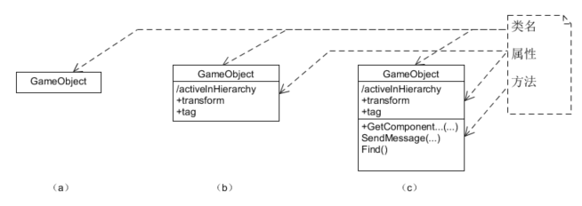
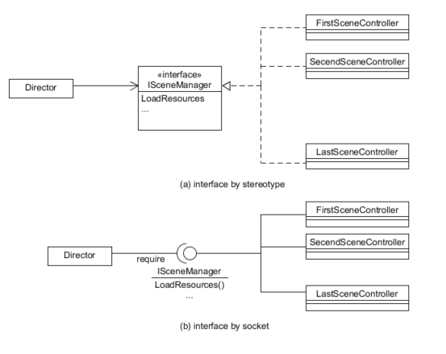

# 附件一、UML符号与面向对象的设计

{:.no_toc}

> **_工欲善其事，必先利其器_**  
>   
> --- 孔子 《论语》

## 1、什么是 UML？

Unified Modeling Language（统一建模语言）是一种标准的图形化编程语言用于软件分析与设计结果的可视化。

本文主要用于描述游戏程序的设计的原理，主要用于类图设计，作用是：

* 表达游戏程序关键结构的设计，方便程序员快速理解程序
* 解释设计模式在游戏中的应用，帮助理解游戏设计场景与设计模式的关系
* 陈述游戏设计要求，指导读者按设计者要求编写程序

## 2、UML 绘图工具？

作为程序员，我们总喜欢与文本界面打交道。所以推荐（本文 UML 图使用 Umlet 绘制）：

* [Umlet](http://umlet.com/)
    - 简单而有效的设计草图绘制工具，敏捷开发首选建模工具。
    - 图形模板，文本驱动，没有太多的语法约束
* [PlantUML](http://plantuml.com/sequence-diagram)
    - 文本驱动绘制工具
    - [在线制作](http://www.plantuml.com/plantuml/uml/)
* [ProcessOn](https://www.processon.com)
    - 万能的在线绘图与分享工具，只能画出个意思，专业就算了!
    - 胜在在线

## 3、设计类图基础符号与含义

### 3.1 类

在 UML 中，设计类用三线表表示。其中第一栏是类名、第二栏属性、第三栏是方法。用户也可以自己扩充第四栏，描述类的职责等。

作为草图工具，追求高效率的沟通设计思想。 **只表达与领域问题相关的属性和方法**，而不是类API的说明，图示三种符号都是合格的类表示：



在 Umlet 中，为了得到（c）类图，仅需要选择一个类到绘图区，在属性区输入文本：

```text
GameObject
-
/activeInHierarchy
+transform
+tag
-
+GetComponent...(...)
SendMessage(...)
Find()

```

### 3.2 类之间关系

在类设计阶段，类之间仅有四种关系：


分别表示：

* 类继承
* 接口实现
* 实例使用
* 依赖

使用类图之间的关系，可以帮助我们理解 Unity 游戏实体构建的通用模型：


这个图反映了 Untity 游戏实体管理的基本概念。每个游戏对象是一个基本实体，这个实体是 Camera？ Light？ Or 3D model 由这个实体包含的 Components 决定。例如：相机对象包含 Camera 相关组件。

GameObject 包含一个 Components 集合，所以 GameObject 必然包含一组方法管理这些不同类型的 Components。 每个表示这个事实，UML 使用 **多重性** 表示这种关系。

其中，箭头表示拥有指向对象的实例，多重性表示**实例数量约束**。在 Umlet 中这样设置线的属性：

```
lt=<-
m1=1..*
m2=1
```

其中 lt 表示线型，m1,m2分别表示线段两个端点的多重性。

GameObject 与 Transform 对象之间是 **1 对 1 互相引用** 紧耦合关系。即 GameObject 对象必须有一个非空 transform 实例变量，Transform 对象必须对应有非空 gameObject 实例变量。这个强制的约束也决定了 Transform 的超然地位，因为 Transform 的 parent 属性决定了 GameObject 之间的空间组合关系，使用 Component 访问 transform 比访问 gameObject 方便和实用。

最后，MonoBehaviour 是一个处理 GameObject 行为和事件的对象。它们是一个特殊的 Component，由游戏引擎调度管理。

### 3.3 接口

接口是一种抽象数据类型，描述具有相同操作定义集合的对象。

例如：电影有许多场景构成，每个场景都有一个角色负责部署场景需要的各种资源部署，但导演并不知道每个场景由什么样的人承担这个角色，更不知道场景实现的细节。假设我们用 ISceneManager 定义这个角色拥有的操作，在具体场景中，导演仅需要被告知承担这个角色的对象（不是类），就可以对它下达布置场景等命令，从而实现了命令与执行的分离。UML 可用以下符号表示这样的程序结构：



上图中，(a) 与 （b）具有相同的含义。（a） 运用 UML 关键字 interface 申明这个三线表是接口，所以第二栏定义为方法申明。(b) 是接口的套接字形式，说明场景控制器提供 ISceneManager 申明的服务， Director 使用服务。这样我们把业务逻辑不同类的对象，都看作接口类型的实例使用。

特别的，由于游戏人机交互规则通常在不同关卡都是一样的，使用 IUserAction 这样的接口描述人机交互规则，可以更好的理解并组织游戏的对象

### 3.4 属性

### 3.5 方法/事件句柄

### 3.6 构造型(stereotype)


